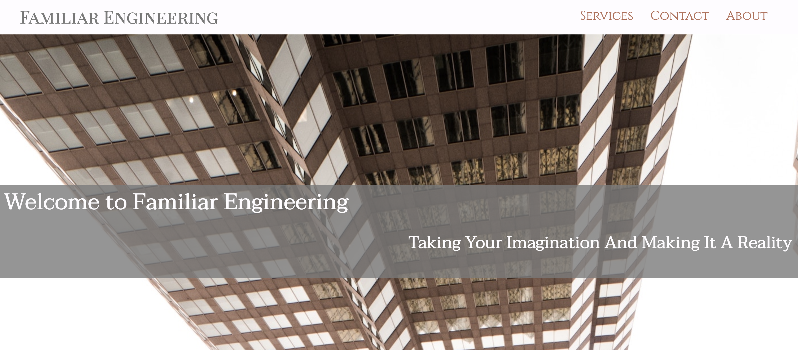
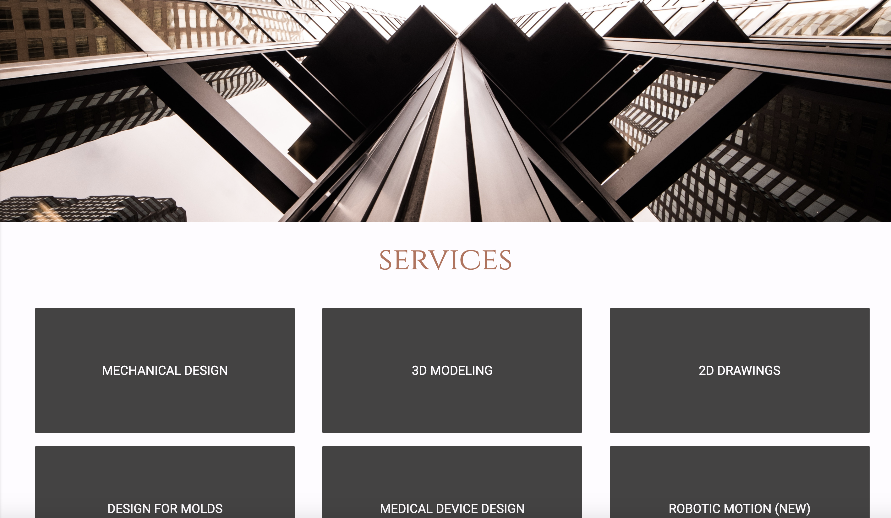
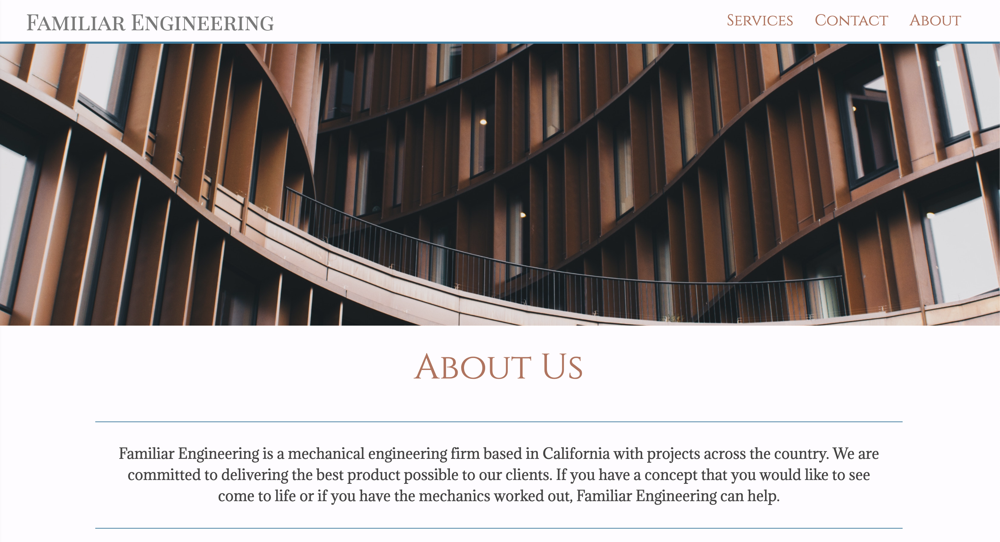

#  Familiar Engineering 
 _Full Stack Application_

#### Deployed Link:
* https://fam-engineering.herokuapp.com

### About

This website was developed for an engineering firm. The "Contact" page contains a form that will save entries to the database, Firebase, as well as email the firm all information entered by users (NodeMailer). Website is mobile friendly, including hamburger menu navigation bar. 

***

***

***

***

***

### Technologies Used

* Firebase

* NodeMailer

* Express

* Node JS

* Javascript

